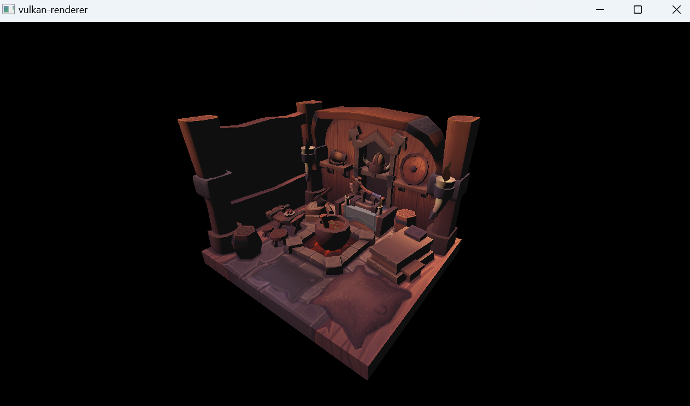

# dunya-renderer

A Vulkan 1.4 renderer written from scratch in C++20 — dynamic rendering, no
`VkRenderPass`, `synchronization2` barriers written by hand, and one RAII
wrapper per Vulkan resource. No engine, no framework, no helper library over
the API: GLFW for the window, GLM for the math, and the raw C API for
everything else.



## What it does

- **Dynamic rendering** (`vkCmdBeginRendering`) — no render pass, no
  framebuffer objects. Swapchain image layout transitions
  (`UNDEFINED → COLOR_ATTACHMENT_OPTIMAL → PRESENT_SRC_KHR`) are written as
  explicit `VkImageMemoryBarrier2`s with per-barrier stage and access masks.
- **Frames in flight** — two frames in flight with fences, one
  image-available semaphore per frame and one render-finished semaphore *per
  swapchain image*, submitted through `vkQueueSubmit2`.
- **Resize-safe swapchain** — recreated on `VK_ERROR_OUT_OF_DATE_KHR`,
  `VK_SUBOPTIMAL_KHR` or a framebuffer-size callback; blocks cleanly while the
  window is minimised.
- **Indexed meshes from OBJ** — tinyobjloader, vertices deduplicated through a
  hash map, uploaded to device-local memory via staging buffers. Memory type
  selection is hand-written against `VkPhysicalDeviceMemoryProperties`.
- **Textures** — stb_image → staging buffer → `VK_IMAGE_TILING_OPTIMAL` image,
  with the layout transitions and buffer-to-image copy done through one-shot
  command buffers; sampled with a linear filter.
- **Depth buffering** — dedicated depth image and view, cleared per frame,
  `VK_COMPARE_OP_LESS`, transitioned into `DEPTH_ATTACHMENT_OPTIMAL` alongside
  the colour barrier.
- **MVP uniforms** — one uniform buffer per frame in flight, persistently
  mapped, bound through a descriptor set together with the combined image
  sampler.
- **Fly camera** — quaternion yaw/pitch (pitch clamped to ±89°), perspective
  projection with the Vulkan Y-flip and `GLM_FORCE_DEPTH_ZERO_TO_ONE`.
- **Input system** — a per-key state machine producing `Pressed`, `Released`,
  `SinglePressed`, `DoublePressed`, `Hold` and `Repeat` events with
  configurable timings, delivered through a small type-indexed event
  dispatcher. Input is focus-gated: alt-tabbing away releases the cursor and
  drops held movement instead of stranding it.
- **Diffuse lighting** — `max(0, N·L)` against a fixed directional light, in
  GLSL, over the sampled albedo.
- **Validation layers are always on**, in every configuration. A validation
  message is treated as a bug, not a warning.

## Requirements

- **LunarG Vulkan SDK** (developed against 1.4.350) with `VULKAN_SDK` set. It
  is needed at build time for `glslc`, and at run time for the validation
  layers, which this project never disables.
- **CMake ≥ 3.28**
- **A C++20 compiler** — MSVC (VS 2022 or newer) is what this is built and
  tested with.
- **A 64-bit target.** On a 32-bit target `VK_NULL_HANDLE` expands to `0ULL`
  rather than `nullptr`, and assigning it to a dispatchable handle does not
  compile. Configure with `-A x64` (or select an `amd64` kit in your IDE).
- A GPU with Vulkan 1.3 core features `dynamicRendering` and
  `synchronization2`, plus `samplerAnisotropy`. Device selection rejects
  anything that lacks them.

GLFW 3.4, GLM, stb and tinyobjloader are fetched automatically by CMake —
there is nothing to install or vendor by hand, and a clean clone builds with
no further setup.

## Build and run

```powershell
cmake -S . -B build -A x64
cmake --build build --config Debug
./build/Debug/DunyaRenderer.exe
```

Shaders are compiled to SPIR-V by `glslc` as a CMake build step (never by
hand), and the compiled shaders, textures and models are copied next to the
executable after every build, so the program must be run from its own output
directory.

## Controls

| Input | Action |
|---|---|
| `W` / `A` / `S` / `D` | Move forward / left / back / right |
| `E` / `Q` | Move up / down |
| Mouse | Look |
| `Esc` | Toggle input capture (releases the cursor) |

Losing window focus suspends camera input and restores the cursor; regaining
it resets the cursor delta so the view never jumps.

## Architecture notes

**One owner per resource.** Every Vulkan handle lives in a class that creates
it in its constructor and destroys it in its destructor: `Instance`,
`Surface`, `Device`, `SwapChain`, `Pipeline`, `Buffer`, `Image`, `Texture`,
`DepthImage`, `Descriptors`, `Renderer`. Nothing calls `vkDestroy*` from
application code, and there is no cleanup function to forget.

**Rule of five below, rule of zero above.** Move constructors and move
assignment are written by hand only in the classes that directly own raw
handles — `Buffer` and `Image`. Classes composed of those (`Mesh`, `Texture`,
`DepthImage`) get correct moves for free and are immune to the
forgotten-member bug that hand-written moves invite.

**Member declaration order is the initialisation order.** `Application` is
composition and nothing else, and the order its members are declared in is
load-bearing: `GLFWLibrary` is declared first so that `glfwInit()` happens
before any window exists and `glfwTerminate()` happens after every GLFW-owning
member is already destroyed. A constructor body runs *after* its members are
built and a destructor body runs *before* they are destroyed, so a library
lifetime can never live in a function body — it has to be a member.

**Levels and deltas are different things.** A held key is state that survives
across frames and is cleared by a release event; a cursor movement describes
exactly one frame and is meaningless in the next. The cursor is therefore
sampled unconditionally — even while input is gated — so that its baseline can
never go stale, and only *consumption* is gated. Key presses are gated;
releases never are, since dropping a release strands the state it was supposed
to end.

**Swapchain-owned handles are never cached.** Anything that a `recreate()` can
replace — images, image views, extent — is queried live or passed as a
parameter. A cached copy of a recreatable handle is a use-after-free with a
delay.

## Known limitations

This is v0.1, and it is honest about what it is not:

- The scene is hardcoded — a single mesh and texture, chosen in
  `Application`'s constructor. There is no scene graph, no material system and
  no asset pipeline.
- No mipmaps and no MSAA; the sampler runs at a single LOD with anisotropy
  disabled.
- The normal matrix is `mat3(model)`, which is correct only for rotation and
  uniform scale. A non-uniformly scaled model would light incorrectly.
- One hardcoded directional light and a small constant ambient term. No
  specular, no shadows, no point lights.

## Next

Beyond v0.1 the project moves toward **fields as an alternative spatial
representation next to triangle meshes**: an analytic SDF ray marcher as a
second pipeline composed into the same scene with correct depth interaction,
then CPU-side field queries, a small fixed-timestep physics prototype, and
editable fields where a single edit is reflected in both CPU collision and GPU
rendering.

## Credits and references

The order things are built in follows
[vulkan-tutorial.com](https://vulkan-tutorial.com/) — instance, devices,
swapchain, pipeline, buffers, descriptors, textures, depth, model — while the
modern parts that tutorial predates, dynamic rendering and `synchronization2`,
follow the current [Khronos Vulkan
Tutorial](https://docs.vulkan.org/tutorial/latest/) instead. Sascha Willems'
samples served as a reference for the raw C API.

What does not come from the tutorial is the ownership layer. The tutorial
keeps every handle in one large class and tears them down by hand in a
`cleanup()` function; here each resource gets its own RAII wrapper, with copy
and move policy decided at declaration, hand-written moves only in the classes
that own raw handles, and destruction driven entirely by scope. That design,
and the C++ it is made of, is mine. The code is written by hand rather than
copied — the writing is the point of the project.

The scene model, `models/viking_room.obj` with `textures/viking_room.png`, is
[Viking room](https://sketchfab.com/3d-models/viking-room-a49f1b8e4f5c4ecf9e1fe7d81915ad38)
by **nigelgoh**, licensed [CC BY
4.0](https://creativecommons.org/licenses/by/4.0/) and used here in the form
distributed with the Vulkan tutorial.
